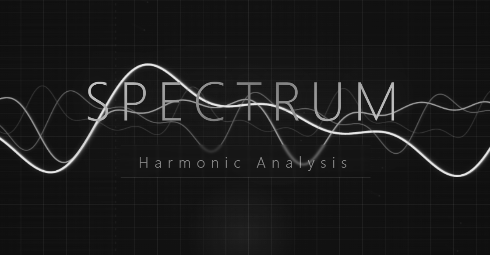

# Spectrum — Interactive Harmonic Analysis Laboratory

An experimental web project in a black‑and‑white scientific style that visualizes waves, spectra, and complex oscillatory systems in real time.  
It is designed for exploring physics, mathematics, signal processing, and for creative experiments with abstract forms.

---

## What is a “spectrum” and why does it matter?

In physics and mathematics, a **spectrum** is the decomposition of a complex signal into its simple harmonic components (sine waves) with different frequencies and amplitudes.  
This site lets you **see this process** interactively:

- generate waves with various parameters;
- observe their superposition;
- view the frequency composition (spectrum);
- explore Lissajous figures and phase portraits.

This is not just a “nice animation” — it is a **visual demonstration of the fundamentals of harmonic analysis**, useful for students, engineers, artists, and the simply curious.

---

## Features

### 7 visualization modes (switchable by buttons)

| Mode       | Description |
|------------|-------------|
| Wave       | Classic oscilloscope – several superimposed waves with adjustable number of harmonics. |
| Spectrum   | Frequency spectrum (harmonic amplitudes) as vertical bars – like a spectrum analyzer. |
| Lissajous  | Lissajous figures – trajectories of two perpendicular oscillations. Visualise frequency ratios. |
| 3D Surface | Pseudo‑3D surface showing a wave in time and space. |
| Polar      | Polar coordinates – amplitude as radius, time as angle. |
| Phase      | Phase portrait – velocity (derivative) vs. position. Demonstrates a damped oscillator. |
| Spectrogram| Running spectrogram (time‑frequency map) – a heatmap of spectral evolution over time. |

---

### Interactive parameters (sliders)

- **Frequency** – fundamental oscillation frequency.
- **Amplitude** – signal “loudness”.
- **Harmonics** – number of additional harmonics (1 to 5).
- **Speed** – animation tempo.
- **Phase** – global phase shift of all waves (0–2π).
- **Damping** – damping coefficient (for phase portrait).
- **Frequency ratio** – for Lissajous figures (ratio of the two frequencies).

---

### Controls

- **Auto** – automatic parameter cycling (generative animation).
- **Pause** – freeze time for detailed inspection.
- **Invert** – invert colours (black ↔ white).
- **PNG** – save current frame as an image.
- **Reset** – restore all parameters to default.

---

### Interactivity

- Mouse movement or touch (on phones) changes the phase of the waves in **Wave** and **Lissajous** modes – you can “play” with the shape just by dragging your finger or mouse.
- A soft glow follows the cursor – a visual feedback.

---

## Responsive design

The interface automatically adapts to any screen size:
- on desktops – a full control panel at the bottom‑right;
- on tablets and phones – compact elements optimised for touch input.

---

## Technical details

- **Stack:** pure HTML, CSS, JavaScript (no external libraries).
- **Graphics:** Canvas 2D with persistence and shadow effects.
- **Style:** minimalistic, focused on geometry and contrast, black‑and‑white palette (with inversion).
- **Performance:** optimised for smooth operation even on mobile devices.

---

## How to run

1. Download the `index.html` file.
2. Open it in any modern browser (Chrome, Firefox, Safari, Edge).
3. Enjoy!

---

## License

The project is distributed freely for non‑commercial use.  
Author — **MORAITTI**.

---

## Contributions and development

If you have ideas for improvements (new modes, sound synthesis, data export) – send suggestions, fork, and experiment.

---

*Science begins with observation. Observe and wonder.*
